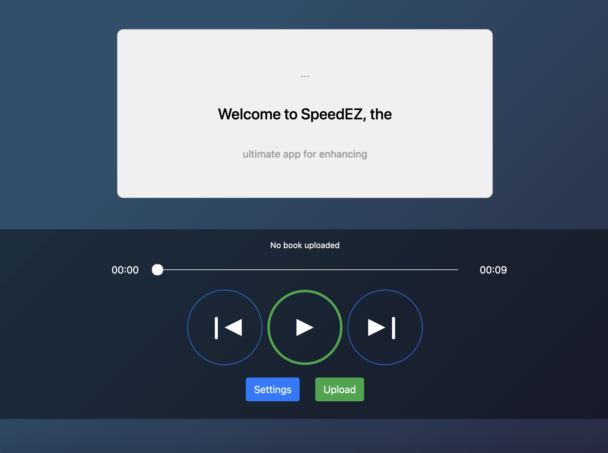
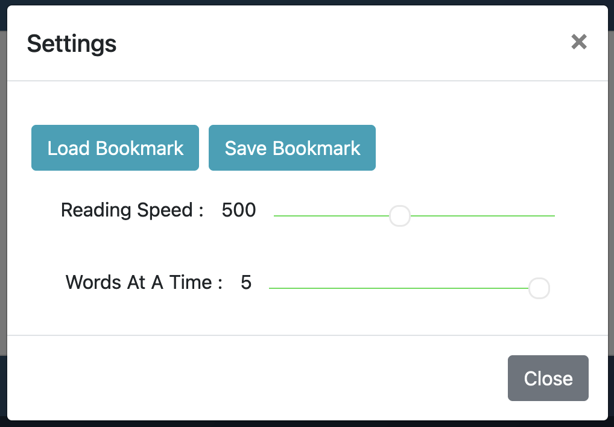

# SpeedEZ Speedreading Program



## Overview
**SpeedEZ** is a sleek and intuitive speedreading application designed for the web. Unlike traditional speedreading tools that are primarily geared toward practice, SpeedEZ is intended for continuous use, providing a comfortable and visually appealing reading experience. 

Whether you're a casual reader or someone looking to enhance reading speed while maintaining comprehension, SpeedEZ offers the tools you need to read efficiently without compromising on the quality of your experience.

---

## Features

### 1. **Customizable Reading Experience**
- **Words Per Minute (WPM):** Adjust the speed of the text display to match your reading pace. 
- **Words Per Line:** Customize the number of words displayed per line, allowing for an optimized reading flow that suits your preferences whether you want to read one word at a time or eight.
- **Save and Load Bookmarks:** SpeedEZ allows you to bookmark your reading progress, making it easy to pick up where you left off. Whether you're reading a lengthy novel or a short article, your place is saved, ensuring seamless continuity.



### 2. **File Conversion**
- **Supported Formats:** SpeedEZ supports the conversion of various file formats including PDF, EPUB, TXT, and MOBI into the speedreading format. 


### 3. **Contextual Preview**
- **Previous and Next Text Preview:** To avoid disorientation while skipping through text, SpeedEZ provides a preview of both the previous and upcoming lines. These previews are displayed with reduced opacity, allowing you to gain context without being distracted from the main text.


### 4. **Scrub Through Text**
- **Slide Bar Control:** SpeedEZ features a convenient slide bar that allows you to scrub through the text seamlessly. This enables you to quickly navigate to any part of the book or document without having to scroll manually. Simply drag the slider to the desired position, and the text will jump to that section.


### 5. **Intuitive Controls**
- **Step-by-Step Navigation:** For users who prefer a more granular control over their reading, SpeedEZ offers the ability to skip through the text piece by piece. You can move backward or forward at your own pace, reviewing sections or jumping ahead without losing your place, making it perfect for users who like to reread or skip certain sections.
- **Layout:** Layout was heavily inspired by the intuitive 
  - **Pause/Play:** Pause/Resume text
  - **Backtrack/Forward Track:** Easily move backward or forward line by line to review something you missed or skip ahead.


## Design Philosophy

**SpeedEZ** was developed with the goal of creating a speedreading app that is both functional and visually pleasing, catering to users who want to integrate speedreading into their daily routine. 

The app’s interface is designed to be clean and user-friendly, emphasizing ease of use and aesthetic appeal. Unlike other speedreading tools that are often used for practice, SpeedEZ is meant to be a tool for regular use, helping you read more efficiently while still enjoying the reading experience.

---

## Future Developments

SpeedEZ is continuously evolving to offer a more seamless and engaging reading experience. Below are some planned enhancements:

### 1. **Conversion to React**
   - **Scalability and Performance:** SpeedEZ will be re-engineered using React for improved scalability and performance, enabling faster load times, a more responsive interface, and better scalability for future features.

### 2. **HTML Page Text Scraping**
   - **Grabbing Text from Web Pages:** Future versions of SpeedEZ will include the ability to extract text directly from an HTML page. This will allow users to import and speedread articles, blogs, or other web content without needing to copy and past text.

### 3. **Display Previously Uploaded Material**
   - **Library of Past Uploads:** Users will be able to access a library of previously uploaded files, making it easy to return to books or documents they've read before without re-uploading them.

### 4. **Personalized Comprehension Quizzes**
   - **AI-Powered Quizzes:** SpeedEZ will integrate with ChatAPI to generate personalized comprehension quizzes based on the material you’ve read. These quizzes will help reinforce learning and comprehension, making the speedreading process not only faster but also more effective.

## Installation

1. Clone the repository:
   ```bash
   git clone https://github.com/jacknelsongardner/SpeedEZ.git
